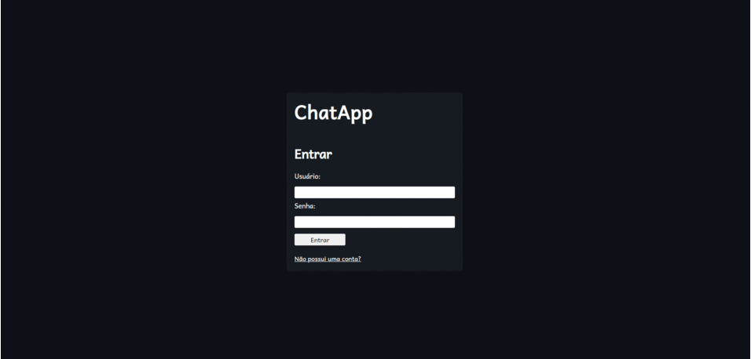

<h1 align="center">
     <a href="https://chat-pern.herokuapp.com" alt="link-chatapp"> ChatApp </a>
</h1>

<h3 align="center">
    ChatApp é um aplicativo de conversas.
</h3>

<p align="center">
  

  

  <a href="https://www.twitter.com/lucasgbsampaio/">
    
  </a>
  
  <a href="https://github.com/lucasgbsampaio/chatroom-app/commits/master">
    
  </a>
    
   
   <a href="https://github.com/lucasgbsampaio/chatroom-app/stargazers">
    
  </a>

</p>

<h4 align="center">
	🚧 Concluído 🚧
</h4>

# Tabela de conteúdos

<!--ts-->

- [Sobre o projeto](#-sobre-o-projeto)
- [Funcionalidades](#%EF%B8%8F-funcionalidades)
- [Demonstração da aplicação](#-demonstração-da-aplicação)
- [Como executar o projeto](#-como-executar-o-projeto)
  - [Pré-requisitos](#pré-requisitos)
    - [Rodando o Backend (servidor)](#user-content--rodando-o-backend-servidor)
    - [Rodando a aplicação web (Frontend)](#user-content--rodando-a-aplicação-web-frontend)
- [Tecnologias](#-tecnologias)
  - [Website](#website--react)
  - [Server](#server--nodejs)
- [Autor](#-autor)
- [Licença](#user-content--licença)

<!--te-->

## 💻 Sobre o projeto

Aplicativo de salas de conversas com comunicação em tempo real através de websockets.
Totalmente responsivo, possui uma versão adaptada para mobile.

---

## ⚙️ Funcionalidades

As seguintes funcionalidades estão disponíveis:

- [x] os usuários registrados podem:

  - [x] listar todos os usuários registrados, e se preferir, filtrá-los
  - [x] iniciar uma conversa com outro usuário e mandar mensagens

---

## 🔍 Demonstração da aplicação

A aplicação está hospedada no [Heroku](https://chat-pern.herokuapp.com)

### Web

<p align="center" style="display: flex; align-items: flex-start; justify-content: center;">
  
</p>

### Mobile

<p align="center" style="display: flex; align-items: flex-start; justify-content: center;">
  
</p>

---

## 🚀 Como executar o projeto

Este projeto é divido em duas partes:

1. Backend (pasta src)
2. Frontend (pasta client)

### Pré-requisitos

Antes de começar, você vai precisar ter instalado em sua máquina as seguintes ferramentas:
[Git](https://git-scm.com), [Node.js](https://nodejs.org/en/) e [Yarn](https://yarnpkg.com/).
Além disso, terá que ter o [PostgreSQL](https://www.postgresql.org/download/) para ter
acesso a um banco de dados próprio.

#### 🎲 Rodando o Backend (servidor)

```bash

# Clone este repositório
$ git clone https://github.com/lucasgbsampaio/chatroom-app.git

# Acesse a pasta do projeto no terminal/cmd para ter acesso a raiz da pasta
$ cd chatroom-app

# Instale as dependências
$ yarn

# Crie um arquivo .env na raiz seguindo as especificações do arquivo sample.env,
# colocando suas credencias do seu banco de dados

# Rode as migrações do banco de dados
$ yarn sequelize db:migrate

# Acesse a pasta src e vá para server.js
# em cors coloque a origin http://localhost:3000,
# que será a porta onde o client será hospedado

# Execute a aplicação em modo desenvolvimento
$ yarn dev

# O servidor iniciará na porta:5000 - acesse http://localhost:5000

```

#### 🧭 Rodando a aplicação web (Frontend)

```bash


# Acesse a pasta do frontend no seu terminal/cmd
$ cd client

# Instale as dependências
$ yarn

# Execute a aplicação
$ yarn start

# A aplicação será aberta na porta:3000 - acesse http://localhost:3000

```

---

## 🛠 Tecnologias

As seguintes ferramentas foram usadas na construção do projeto:

#### Website ([React](https://reactjs.org/))

- **[React Router Dom](https://github.com/ReactTraining/react-router/tree/master/packages/react-router-dom)**
- **[dotenv](https://github.com/motdotla/dotenv#readme)**
- **[Bootstrap](https://getbootstrap.com/)**
- **[React Icons](https://www.npmjs.com/package/react-icons)**
- **[Socket.io](https://socket.io/)**

> Veja o arquivo [package.json](https://github.com/lucasgbsampaio/chatroom-app/blob/master/client/package.json)

#### Server ([NodeJS](https://nodejs.org/en/))

- **[Express](https://expressjs.com/)**
- **[CORS](https://expressjs.com/en/resources/middleware/cors.html)**
- **[dotenv](https://github.com/motdotla/dotenv#readme)**
- **[JsonWebToken](https://www.npmjs.com/package/jsonwebtoken)**
- **[Socket.io](https://socket.io/)**
- **[node-postgres](https://www.npmjs.com/package/pg)**
- **[Sequelize](https://sequelize.org/master/index.html)**
- **[BodyParser](https://www.npmjs.com/package/body-parser)**
- **[bcrypt](https://www.npmjs.com/package/bcrypt)**

> Veja o arquivo [package.json](https://github.com/lucasgbsampaio/chatroom-app/blob/master/package.json)

---

## 👨‍💻 Autor

- **Lucas Sampaio (lucasgbsampaio)** - [Twitter](https://twitter.com/lucasgbsampaio) - [LinkedIn](https://www.linkedin.com/in/lucasgbsampaio/)

---

## 📝 Licença

Este projeto está sob a licença [MIT](./LICENSE).

---
